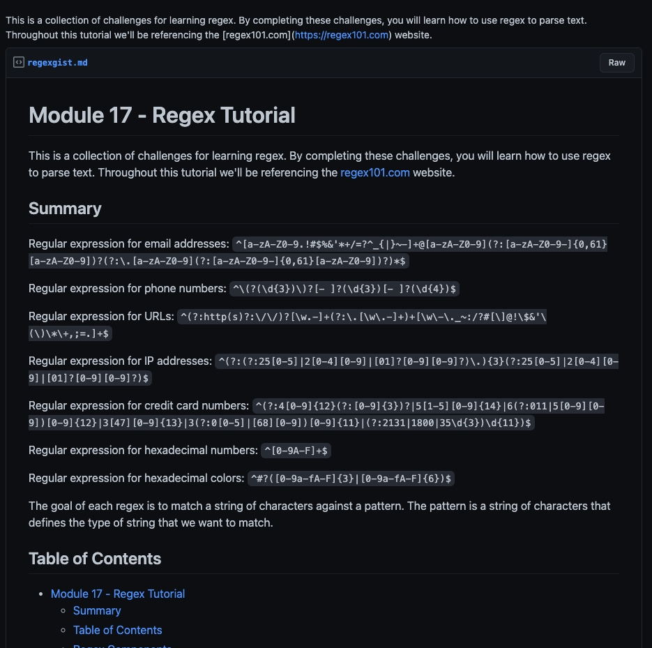

# Module 17 - Regex Tutorial

<h1 align="center">
    <a href="https://gist.github.com/Somdobomk/bfb809a4018b8fb7b59d01961715e3cd" target="_blank">
     View Demo
    </a>
</h1>
<div align="center">
    
</div>

## Table of Contents

- [Module 17 - Regex Tutorial](#module-17---regex-tutorial)
  - [Table of Contents](#table-of-contents)
  - [Summary](#summary)
  - [Regex Components](#regex-components)
    - [Anchors](#anchors)
    - [Quantifiers](#quantifiers)
    - [OR Operator](#or-operator)
    - [Character Classes](#character-classes)
    - [Flags](#flags)
    - [Grouping and Capturing](#grouping-and-capturing)
    - [Bracket Expressions](#bracket-expressions)
    - [Greedy and Lazy Match](#greedy-and-lazy-match)
    - [Boundaries](#boundaries)
    - [Back-references](#back-references)

This is a collection of challenges for learning regex. By completing these challenges, you will learn how to use regex to parse text. Throughout this tutorial we'll be referencing the [regex101.com](https://regex101.com) website.

## Summary

Regular expression for email addresses: `^[a-zA-Z0-9.!#$%&'*+/=?^_{|}~-]+@[a-zA-Z0-9](?:[a-zA-Z0-9-]{0,61}[a-zA-Z0-9])?(?:\.[a-zA-Z0-9](?:[a-zA-Z0-9-]{0,61}[a-zA-Z0-9])?)*$`

Regular expression for phone numbers: `^\(?(\d{3})\)?[- ]?(\d{3})[- ]?(\d{4})$`

Regular expression for URLs: `^(?:http(s)?:\/\/)?[\w.-]+(?:\.[\w\.-]+)+[\w\-\._~:/?#[\]@!\$&'\(\)\*\+,;=.]+$`

Regular expression for IP addresses: `^(?:(?:25[0-5]|2[0-4][0-9]|[01]?[0-9][0-9]?)\.){3}(?:25[0-5]|2[0-4][0-9]|[01]?[0-9][0-9]?)$`

Regular expression for credit card numbers: `^(?:4[0-9]{12}(?:[0-9]{3})?|5[1-5][0-9]{14}|6(?:011|5[0-9][0-9])[0-9]{12}|3[47][0-9]{13}|3(?:0[0-5]|[68][0-9])[0-9]{11}|(?:2131|1800|35\d{3})\d{11})$`

Regular expression for hexadecimal numbers: `^[0-9A-F]+$`

Regular expression for hexadecimal colors: `^#?([0-9a-fA-F]{3}|[0-9a-fA-F]{6})$`

The goal of each regex is to match a string of characters against a pattern. The pattern is a string of characters that defines the type of string that we want to match.

## Regex Components

### Anchors
- Description:
> Anchors are used to match the beginning or end of a string.

- Syntax: The beginning of a string is marked with a ^ and the end with a $.

- Example:
```
^Hello
Hello$
```

- Note: The beginning and end of a string are not anchored by default.

### Quantifiers
- Description:
> Quantifiers are used to specify how many times a pattern should be matched.

- Syntax:
> * Quantifiers:
>     - *: Matches zero or more times.
>     - +: Matches one or more times.
>     - ?: Matches zero or one time.

- Example:
```
a+
```

### OR Operator
- Description:
> The OR operator is used to match one of the patterns.

- Syntax:
> |: Matches one of the patterns.

- Example:
```
a|b
```

### Character Classes
- Description:
> Character classes are used to match a set of characters.

- Syntax:
> []: Matches any of the characters between the brackets.
> [^]: Matches any character that is not between the brackets.

- Example:
```
[abc]
[^abc]
```

### Flags
- Description:
> Flags are used to control the behavior of the regex.

- Syntax:
> i: Case insensitive.
> m: Multi-line.
> s: Dot matches all characters (including newline).
> u: Unicode.
> x: Allow comments.

- Example:
```
[abc]
[^abc]
```

### Grouping and Capturing
- Description:
> Grouping and Capturing are used to group patterns and capture parts of the string.

- Syntax:
> (pattern): Matches the pattern and stores the match in a capture group.
> (?P<name>pattern): Named capture group.

- Example:
```
(a)
(a)b
(?:a)
(?P<name>a)
```

### Bracket Expressions
- Description:
> Bracket expressions are used to match any of the characters inside the brackets.

- Syntax:
> [...]

- Example:
```
[a-z]
[a-z0-9]
[^a-z]
```

### Greedy and Lazy Match
- Description:
> Greedy and Lazy Match are used to control the behavior of the regex.

- Syntax:
> ?: Lazy match.
> *: Greedy match.

- Example:
```
[a-z]+
[a-z]+?
[a-z]*
[a-z]*?
```

### Boundaries
- Description:
> Boundaries are used to match the beginning or end of a string.

- Syntax:
> ^: Match the beginning of a string.
> $: Match the end of a string.

- Example:
```
^Hello
Hello$
```

### Back-references
- Description:
> Back-references are used to reference a previously matched pattern.

- Syntax:
> \1: References the first capture group.
> \2: References the second capture group.
> \3: References the third capture group.
> \4: References the fourth capture group.
> \5: References the fifth capture group.
> \6: References the sixth capture group.
> \7: References the seventh capture group.
> \8: References the eighth capture group.
> \9: References the ninth capture group.

- Example:
```
(a)(b)
(a)(b)(c)
(a)(b)(c)(d)
(a)(b)(c)(d)(e)
(a)(b)(c)(d)(e)(f)
(a)(b)(c)(d)(e)(f)(g)
(a)(b)(c)(d)(e)(f)(g)(h)
(a)(b)(c)(d)(e)(f)(g)(h)(i)
(a)(b)(c)(d)(e)(f)(g)(h)(i)(j)
(a)(b)(c)(d)(e)(f)(g)(h)(i)(j)(k)
(a)(b)(c)(d)(e)(f)(g)(h)(i)(j)(k)(l)
(a)(b)(c)(d)(e)(f)(g)(h)(i)(j)(k)(l)(m)
(a)(b)(c)(d)(e)(f)(g)(h)(i)(j)(k)(l)(m)(n)
```